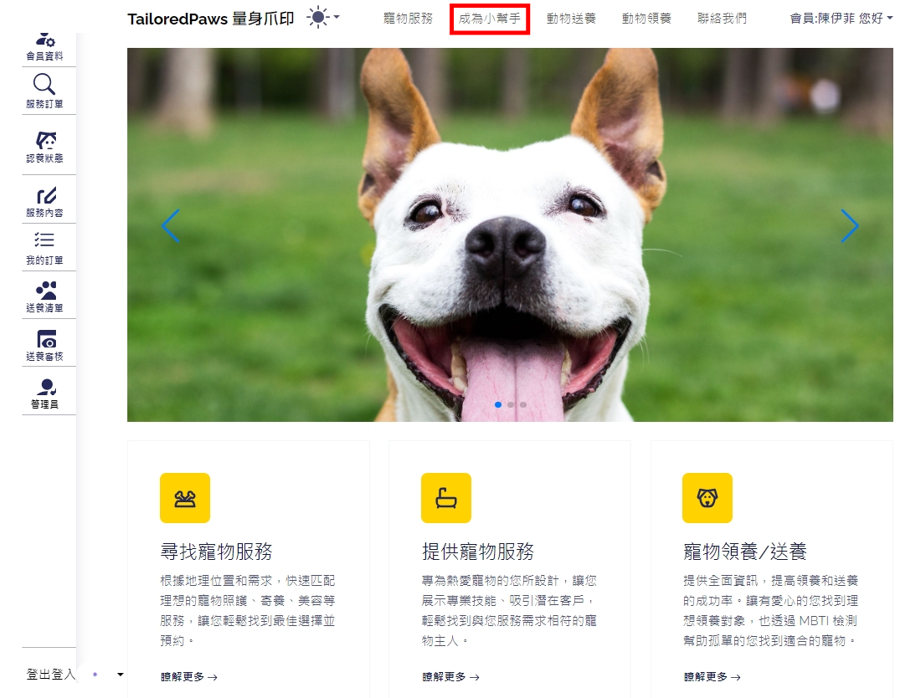

# TeamProject_PetService
Java Professional Training Course _ 5-Person Web Project Practice

A web service that facilitates matching between pet owners and those seeking pets, based on specified requirements.

Thanks to Team Leader 伊倫 and team members (以霏, 意文, 宥榕, and myself) for the collaborative effort.
## [文件解說](thingsForDemo/TailoredPawsfinal-2.pdf) 

# Pet Service
This is a website for pet service. 
# 🐾 寵物服務媒合平台

> 成為寵物界的超級媒人，連結愛心與專業服務！

## 📜 項目簡介
 
寵物服務媒合平台讓用戶體驗成為寵物服務的核心樞紐。通過我們的平台，寵物主人可以輕鬆找到各種所需的服務，包括寵物照顧、寵物領養和送養等。同時，熱愛動物的人們可以註冊成為服務提供者，為可愛的毛孩子們提供專業的照顧。這個平台不僅為寵物主人提供便利，還為寵物愛好者創造了參與和貢獻的機會。

## ✨ 特色
- 🔍 全面的寵物服務搜尋功能
- 🏠 寵物領養和送養媒合系統
- 👥 服務提供者註冊和管理
- 💾 個人化的寵物檔案管理
- 🖨️ 服務訂單打印選項
- 🔐 安全的用戶帳號系統

## 🕹️ 如何使用
1. 註冊您的帳號（寵物主人或服務提供者）
2. 瀏覽可用的寵物服務或發布服務需求
3. 搜尋並聯繫合適的服務提供者或寵物主人
4. 安排並確認服務細節
5. 完成服務後進行評價
6. 管理您的訂單歷史和收藏列表

詳細的平台使用指南請參考我們的[用戶手冊](thingsForDemo/TailoredPawsfinal-2.pdf)。

## 🔧 技術工具
- 前端：BootStrap, HTML, CSS, AngularJS
- 後端：SpringBoot, Java
- 數據庫：MySQL
- 開發環境：Visual Studio Code, Eclipse

